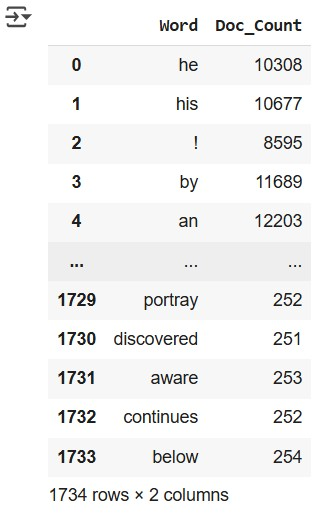
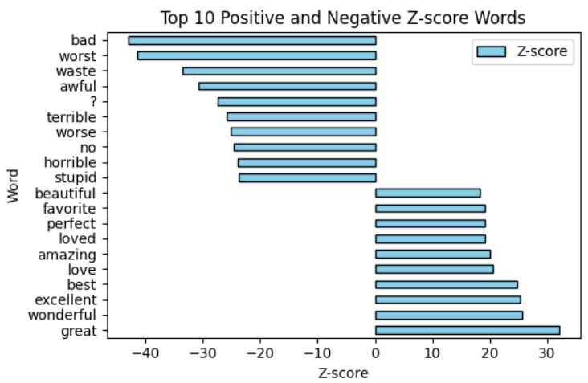
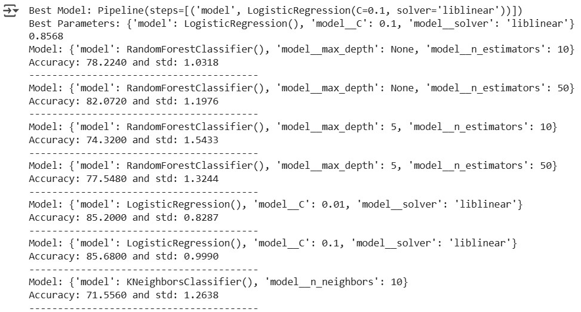
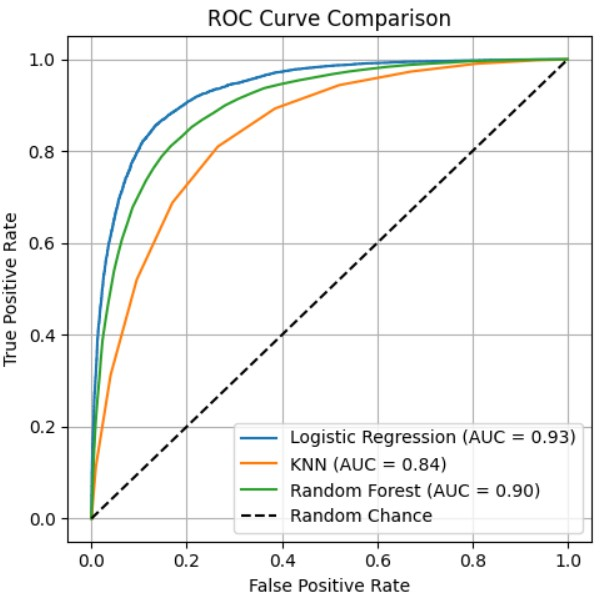

# Mcgill_COMP551_Applied_ML_IMDB_Reviews_Dataset
The projects of Applied Machine Learning (COMP 551) at Mcgill University; Classification using Logistic Regression, KNN and Random Forest evaluated by ROC on IMDB Reviews Dataset

# IMDB Reviews Sentiment Classification
This repository contains a full machine learning workflow for sentiment classification using the IMDB Reviews dataset. The objective is to classify movie reviews as positive or negative based on their text content. The models used include Logistic Regression, K-Nearest Neighbors (KNN), and Random Forest.

# Dataset
The IMDB Reviews dataset is a popular binary sentiment classification dataset containing 50,000 movie reviews labeled as either positive or negative. It is available from sources like https://ai.stanford.edu/%7Eamaas/data/sentiment/

# Project Structure
The workflow is divided into three main tasks:

🧹 **Task 1: Data Preprocessing**
Importing the IMDB Reviews dataset
Text cleaning: space reduction by filtering words
Feature extraction: converting text into numerical vectors
Feature importance analysis using z-scores
Train-test split: preparing the training and testing datasets

🤖 **Task 2: Model Implementation**
Logistic Regression
K-Nearest Neighbors (KNN)
Random Forest Classifier
Hyperparameter tuning via cross-validation pipeline for all models to optimize performance

📈 **Task 3: Prediction & Evaluation**
Generating predictions on the test set
Comparing model performance using ROC curves

## 📊 Illustrations

### 📝 Word Counts After Masking

---

### 🧬 Feature Importance  
Deriving feature importance using z-score:

---

### ⚙️ Model Optimization Using Pipelines

---

### 📊 Model Evaluation  
ROC:  

Please explore the notebook for more!
